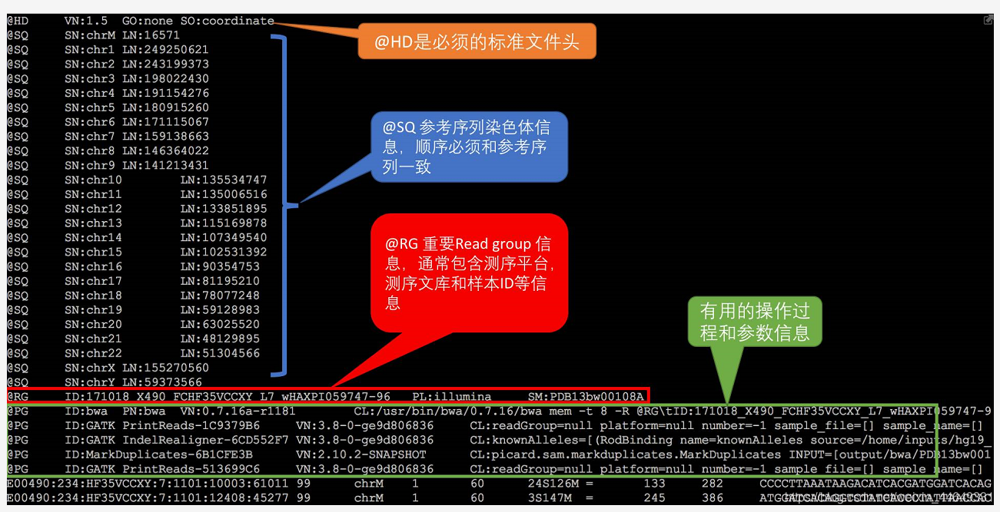
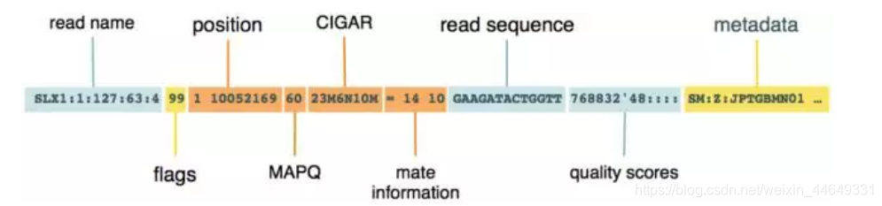
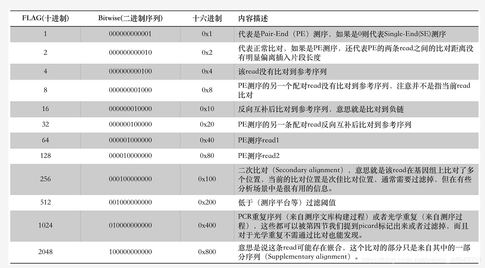
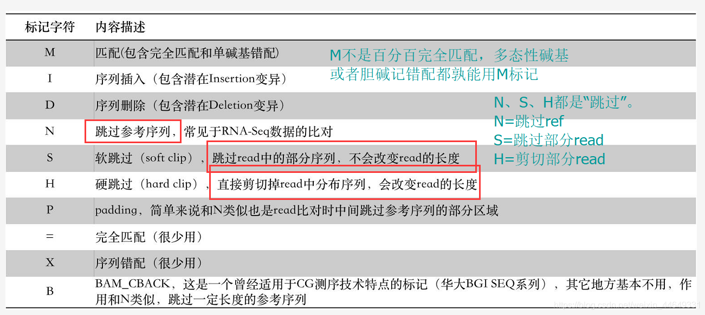
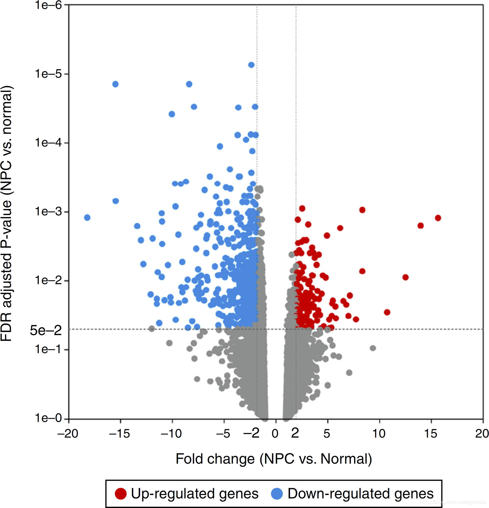

# RNA-Seq
## 一、测序方法对比
第一代测序技术(Sanger测序)：

* 测序读长(可达1000bp)、测序准确率(高达99.999%)。
* 测序成本高、通量低等缺点

第二代测序技术(NGS)：illumina

* 测序速度快、测序成本低、准确性高
* 测序读长比第一代测序技术要短很多(一般100-150bp)。

第三代测序技术：

* 单分子测序，测序过程无需进行PCR扩增。读长较长，可以减少拼接成本，节省内存和计算时间。
*  单读长的错误率偏高，需重复测序以纠错（增加测序成本）

## 二、illumina测序原理
#### 1.建库
* 不可能直接拿整个基因组去测序，在测序的时候需要先打断成一定长度的片段。目前最好的X Ten也就是双端各150bp。例如测人的基因组，将其打断成300 ~ 500bp的长度，通过跑胶控制。
* 打断以后会出现末端不平整的情况，用酶补平，使序列成为平末端。
* 完成补平以后，在3'端使用酶加上一个特异的碱基A，使序列变为粘性末端
* 利用互补配对的原则，加上接头（adapter），adpater可以分成两个部分，一个部分是测序的时候需要用的引物序列，另一部分是建库扩增时候需要用的引物序列
* 进行PCR扩增，使得DNA样品浓度足够上机要求。
* 建库的示意图如下图所示


#### 2.桥式PCR

将两种接头短序列以化学键预先连接在flowcell中。图中不同的颜色表示的是两种不同的adpater，分别对应序列之前加入的两种adpater


将DNA样品加入到flowcell中，使得序列的一端与flowcell上面已经存在的短序列互补配对。
连接以后就正式开始桥式PCR。

* 首先进行第一轮扩增，将序列补成双链。加入NaOH强碱性溶液破坏DNA的双链，并洗脱。
* 加入缓冲溶液，这时候序列自由端的部分就会和旁边的adpater进行匹配
* 在PCR的过程中，序列是弯成桥状，所以叫桥式PCR，一轮桥式PCR可以使得序列扩增1倍
如此循环下去，就会得到一个具有完全相同序列的簇（cluster）


1个cluster的形态，在整个flowcell中看上去，示意图如下。其中的每1个cluster就算是1群完全相同的序列。


#### 3.测序
加入带荧光基团和叠氮基团的四种碱基，保证每次循环只能延长一个碱基，在激光照射下会发出不同颜色的荧光。


由于每个簇的序列相同，所以发光的颜色一致，能够放大信号。


双末端测序会得到两个read

在进行RNA-Seq时，需要将RNA先反转录为cDNA，再进行测序。总RNA中mRNA仅占5%，可以利用Poly(dT)来捕获mRNA。

## 三、数据分析
测序完成后，我们会得到一个fastq文件

四行为一组，分别表示名称/序列/名称/质量。每行长度相同，均为150。
	
质量用ASCII码表示，防止移位等造成的错误以及减少存储量。有40个级别。


#### 1.质控

每个fastq会有一个质量分析报告，用于描述此次RNA-seq的质量。

```shell
# 创建一个输出目录
mkdir result

# 生成质控报告。参数 -t 指定线程数，-o指定输出位置
fastqc read1.fastq.gz -o result/ -t 20 
```
箱型图。黄线以上为质量较好
	

	
折线表示存在碱基不平衡的问题，一般位于接头处。	


#### 2.去接头

fastp软件：去接头，自动质控

```shell
fastp -i reads.1.fq.gz -I reads.2.fq.gz -o clean.1.fq.gz -O clean.2.fq.gz 
```

#### 3.比对

从NCBI获得基因组数据和注释文件。

测序数据与基因组比对,确定reads在基因组中的关系。

常用工具：HISAT2、Bowtie2。

比对完成后得到sam文件。

sam文件格式说明：

​		@HD：表示参考基因组的排列情况

​		@SQ：参考序列说明；LN：长度

​		@PG：使用的比对程序说明






​	第一列：rname（Qname）即为fq对应的read ID。这一列代表read的名字（比对片段的编号）。

​	第二列：FLAG 比对信息位。将flag值转换为一串由0,1组成的二进制码，这一串二进制数中的每一个位（bit）都代表一个特定的信息，他一共有12位，所以一般会用一个16位的整数来代表，这个整数的值就是由12个0或1组合计算得出的。因此他的数值范围在0~2^12（2048）。



​	第三、四列：position 分别是RNAME(参考序列染色体名)和POS（比对位置，从对应染色体的第1位开始往后计算）

​	第五列：MAPQ(mapping quality) 比对质量值，这个值告诉我们这个read比对到参考序列上这个位置的可靠程度，相当于Q。

​	第六列：CIGAR 比对信息（雪茄字符串）。它用数字和几个字符的组合形式记录了read比对到参考序列上的细节信息，读起来比FLAG直观友好很多，只是记录的信息不同。例子：33S117M，意思是在比对的时候这条read开头的33bp被跳过了（s），紧接其后的117bp则比对上参考序列（M）。这里的S意思都是soft clip。CIGAR的标记字符有：MIDNSHP=XB



​	sam文件转化为bam文件：压缩、排序。

#### 4.count
计算RNA-seq测序reads对在基因组中对比对深度。

常用工具：featureCounts

文件格式：从左到右依次为基因名、染色体号、起始位置、结束位置、长度、表达量

```featureCounts
# Program:featureCounts v1.6.0; Command:"./featureCounts" "-T" "20" "-t" "exon" "-g" "gene_id" "-a" "hg19.gtf" "-o" "gene" "accepted_hits.bam" 						
Geneid	Chr	Start	End	Strand	Length	accepted_hits.bam
LOC102725121	chr1;chr1;chr1;chr15;chr15;chr15	11869;12613;13221;102516808;102518449;102518943	12227;12721;14362;102517949;102518557;102519301	+;+;+;-;-;-	3220	0
DDX11L1	chr1;chr1;chr1	11874;12613;13221	12227;12721;14409	+;+;+	1652	0
WASH7P	chr1;chr1;chr1;chr1;chr1;chr1;chr1;chr1;chr1;chr1;chr1	14362;14970;15796;16607;16858;17233;17606;17915;18268;24738;29321	14829;15038;15947;16765;17055;17368;17742;18061;18366;24891;29370	-;-;-;-;-;-;-;-;-;-;-	1769	88
```

* 将以上2、3、4步写入shell脚本，批量处理数据。

```shell
#设置环境变量
# !/bin/bash
#
#$ -cwd
#$ -j y
#$ -S /bin/bash
#
##############################################################################

#hisat2建库
#/sibcb/program/install/hisat2-2.1.0/hisat2-build -p 4 \
#/sibcb1/hurongguilab1/zhumin/YangYi/Ref/Mus_musculus.GRCm39.dna.primary_assembly.fa \
#/sibcb1/hurongguilab1/zhumin/YangYi/Ref/GRCm39;


### Config INFO ##############################################################
#设置工作目录
workdir=/sibcb1/hurongguilab1/wangxuechen/BV2CALRA;
#定义样本列表
samps_list='BV2-C-1 BV2-C-2 BV2-C-3 BV2-D-1 BV2-D-2 BV2-D-3';
#设置基因组文件路径，注意最后要加注释名
genome=/sibcb1/hurongguilab1/zhumin/Ref/GRCm39.hisat2.bulid/mm39/GRCm39;
#设置基因组注释文件路径
gtf=/sibcb1/hurongguilab1/zhumin/Ref/GRCm39.hisat2.bulid/Mus_musculus.GRCm39.109.gtf;
##############################################################################


### Clean Data ###############################################################
#执行fastp软件对原始数据进行质量控制和过滤
  #打印进度提示
  echo "Workflow 1: fastp";
  #在workdir目录下创建02-CleanData目录及子目录fastp
  mkdir -p ${workdir}/02_CleanData;
  mkdir -p ${workdir}/02_CleanData/fastp;
  #对样本逐一质控，注意fq文件应该在同一目录下，否则需要修改路径
  for id in $samps_list;
    do
      echo ${id};
      /sibcb1/hurongguilab1/renjin/software/fastp \
                          -i ${workdir}/rawdata/${id}/${id}_1.clean.fq.gz \
                          -I ${workdir}/rawdata/${id}/${id}_2.clean.fq.gz \
                          -o ${workdir}/02_CleanData/${id}_clean_R1.fq.gz \
                          -O ${workdir}/02_CleanData/${id}_clean_R2.fq.gz \
                          -h ${workdir}/02_CleanData/fastp/$id.html \
                          -j ${workdir}/02_CleanData/fastp/$id.json;
          done
  #质控完成，打印进度提示
  echo "fastp is done";


### Mapping ##################################################################  
#使用hisat2进行RNA测序数据的比对
  #打印进度提示
  echo "Workflow 2: hisat2";
  #设置工作目录
  mkdir -p ${workdir}/03_hisat2;
  #逐一比对
  for id in $samps_list;
    do
      echo ${id};
      /sibcb/program/install/hisat2-2.1.0/hisat2 \
        -p 20 --dta -x ${genome} \
        -1 ${workdir}/02_CleanData/${id}_clean_R1.fq.gz \
        -2 ${workdir}/02_CleanData/${id}_clean_R2.fq.gz \
        -S ${workdir}/03_hisat2/${id}.sam;
    done
  #比对完成，打印进度提示
  echo "hisat2 id done";


### sort Bam #################################################################
#sam转bam
  #打印进度提示
  echo "Workflow 3: samtools sort";
  #逐一转化、排序
  for id in $samps_list;
    do
      echo ${id};
      /sibcb/program/install/samtools-1.4/bin/samtools sort -@ 20 -o ${workdir}/03_hisat2/${samps}.bam ${workdir}/03_hisat2/${samps}.sam;
      /sibcb/program/install/samtools-1.4/bin/samtools view -h -f 2 -F 4 -q 30  ${workdir}/03_hisat2/${samps}.bam > ${workdir}/03_hisat2/${samps}.mapped.bam;
      #删除sam文件，减轻内存
      rm -rf ${workdir}/03_hisat2/${samps}.sam ${workdir}/03_hisat2/${samps}.bam;
    done
  #转化完成，打印进度提示
  echo "samtools is done";


### featureCounts ############################################################
#计数
  echo "Workflow 4: featureCounts";
  /sibcb/program/bin/featureCounts -T 20 -a ${gtf} -o ${workdir}/featurecount.txt ${workdir}/03_hisat2/*.mapped.bam;
  echo "featureCounts is done";
```

运行脚本：

​	1.在submit节点提交 `qsub RNA.sh`

​	2.在计算节点，直接运行

chmod 修改文件权限

featurecount:

​		:set nowrap不换行，wrap 换行

​		:set nu显示行号，nonu不显示行号

​		删除第一行样本名称中多余的内容

#### 5、差异分析 

（1）读取featureCounts.txt文件，转化为数据框（data frame）counts生成矩阵

（2）PCA：主成分分析

（3）DESeq分析，生成火山图


火山图：横坐标Fold Change 差异倍数

​               纵坐标P_Value差异的显著性




代码如下：

```R
### 导入相关 R包 ###############################################################
  # 安装 DESeq2 
    # install.packages("BiocManager")
     library(BiocManager)
    # BiocManager::install("DESeq2")    
     library(DESeq2)
     library(ggplot2)
  	# install.packages("ggrepel")
     library(ggrepel)

  # GENEID 转化包
    # BiocManager::install("clusterProfiler")
    # library(clusterProfiler)
    # BiocManager::install("org.Hs.eg.db")
    # BiocManager::install("org.Mm.eg.db")
    # library(org.Hs.eg.db)
    # library(org.Mm.eg.db)
    
### 设置工作目录 ###############################################################
  setwd('/home/biotrainee.workspace/RNAseq/')
  getwd()

### 读取数据 ##################################################################
	counts = read.csv('./featurecount.txt',
                  sep = '\t',             # 制表符分隔
                  row.names = 'Geneid',   # 将 'Geneid' 列设置为行名
                  comment.char = '#',     # 以 '#' 开头的行将被认为是注释
                  header = T,             # 文件包含列名（表头）
                  check.names = F)        # 不检查列名的合法性


	# 删除前5列
  counts = counts[,-c(1:4)]
	# 保留行相加 大于 10（根据需要调整）的行
	# 筛选出至少在重复样本数量内的表达量counts大于1的行（基因），表达量过低也没有参考价值。
  counts=counts[rowSums(counts[,-1])>10,]
  counts


### 样本对照关系 抽出 VDR.DBD.DEL 创建一个包含样本和对应组的数据框 ###################
	# 输出当前 counts 数据框的列名
	colnames(counts)
	# 创建一个新的数据框 samples，包含 Sample 列和 Group 列
	samples <- data.frame(Sample = c("BV2-D-1","BV2-D-2","BV2-D-3",
                                     "BV2-C-1","BV2-C-2","BV2-C-3" ),
                      
                      Group = c(rep("DMSO",3),
                                rep("Calc",3)))
  # 输出 samples 数据框中的 Sample 列
	samples$Sample
	# 将 Sample 列设置为 samples 数据框的行名
  row.names(samples) <- samples$Sample
  # 将 Group 列转换为 factor 类型，指定水平为 "DMSO" 和 "Calc"
	samples$Group <- factor(samples$Group,levels = c("DMSO","Calc"))
  # 输出 Group 列
	samples$Group
  # 输出整个 samples 数据框
	samples

### 将 featurecount 转化为 Matrix矩阵 ##########################################
	# 从 counts 数据框中选择与 samples 数据框的行名匹配的行，并将其转换为矩阵
  counts.DEseq <- as.matrix(counts[rownames(samples)])

	# 输出 counts.DEseq 矩阵的维度
	dim(counts.DEseq)

	# 输出 counts.DEseq 矩阵的类别（class）
	class(counts.DEseq)

  
	# DEseq读取
	dds = DESeqDataSetFromMatrix(countData = counts.DEseq, colData = samples, 		design = ~ Group)

	# 差异分析
	dds = DESeq(dds)

	# PCA 查看样本间关系
	vsd = vst(dds, blind = F)

	# 绘制PCA图
	plotPCA(vsd, intgroup = c('Group'))

	# 保存PCA分析结果
	PCAreturn <- plotPCA(vsd, intgroup = c('Group'), returnData = TRUE)

	# 绘制带标签的PCA图
	ggplot(PCAreturn, aes(PC1, PC2, color = group)) +
  geom_point(size = 3) +
  ggsci::scale_color_igv() +
  ggrepel::geom_label_repel(aes(label = name), color = "black", size = 2.5) +
  labs(x = "PC1", y = "PC2", face = 'bold') +
  theme_light(base_size = 16)

	# 清理环境中的变量
	rm(PCAreturn)

##############################################################################
###                          DEseq 差异分析                                 ###
##############################################################################
	# 获取 DESeq2 结果对象的名称
	resultsNames(dds)

	# 提取差异分析结果
	treatment_vs_control <- results(dds, name="Group_Calc_vs_DMSO")

	# 输出差异分析结果的摘要统计
	summary(treatment_vs_control)

	# 将结果转换为数据框
	treatment_vs_control=as.data.frame(treatment_vs_control)

	# 将 counts.DEseq 转换为数据框
	counts.DEseq <- as.data.frame(counts.DEseq)

	# 合并差异分析结果和表达矩阵
	treatment_vs_control <- merge(treatment_vs_control,counts.DEseq,by = 0,Row.names=0)

	# 处理缺失值，将 padj 为 NA 的值设置为 1
	treatment_vs_control$padj[is.na(treatment_vs_control$padj)] = 1

	# 设置行名
	rownames(treatment_vs_control) <- treatment_vs_control$Row.names

	# 删除多余的列
	treatment_vs_control <- treatment_vs_control[,-1]

	# 将基因ID（Ensembl ID）转换为基因符号和Entrez ID
	Ensembl_ID <- row.names(treatment_vs_control)
	gene_symbol <- bitr(Ensembl_ID, fromType="ENSEMBL", toType=c("SYMBOL", "ENTREZID"), OrgDb="org.Mm.eg.db")

	# 输出转换结果的前几行
	head(gene_symbol)

	# 合并基因符号和Entrez ID信息到差异分析结果中
	treatment_vs_control <- merge(gene_symbol,treatment_vs_control,by.x="ENSEMBL" ,by.y=0)

	# 查看火山图
	plot(treatment_vs_control$log2FoldChange,-log10(treatment_vs_control$padj))
write.csv(treatment_vs_control,file = 'treatment_vs_control.csv')

	# 可视化
	df <- treatment_vs_control
	plot(df$log2FoldChange, -log(df$padj))

	# 设置显著性水平和倍数差异的阈值
	P.Value_t <- 0.05
	FC <- 2

	# 选择显著差异基因
	up_genes <- subset(df, df$pvalue < P.Value_t & df$log2FoldChange > FC)
	down_genes <- subset(df, df$pvalue < P.Value_t & df$log2FoldChange < -FC)
	sig_genes <- rbind(up_genes, down_genes)

	# 标记基因类型
	df$gene_type <- ifelse(df$log2FoldChange < -1 & df$pvalue < P.Value_t, "down",
                  ifelse(df$log2FoldChange > 1 & df$pvalue < P.Value_t, "up", "ns"))

	# 创建火山图
	P <- ggplot(df, aes(x = log2FoldChange, y = -log10(pvalue))) +
 		geom_point(aes(color = gene_type), alpha = 0.6, shape = 16, size = 1.8) +
  	geom_point(data = up_genes, shape = 21, size = 2, fill = "red", colour = "black") +
  	geom_point(data = down_genes, shape = 21, size = 2, fill = "steelblue", colour = "black") +
  	geom_hline(yintercept = -log10(0.05), linetype = "dashed") +
  	geom_vline(xintercept = c(-1, 1), linetype = "dashed") +
  	geom_label_repel(data = sig_genes, aes(label = SYMBOL), force = 2, nudge_y = 1) +
  	scale_color_manual(values = c("up" = "#ffad73", "down" = "#26b3ff", "ns" = "grey")) +
  	scale_x_continuous(breaks = c(seq(-8, 8, 2)), limits = c(-8, 8)) +
  	labs(x = "log2(fold change)", y = "-log10(adjusted P-value)", colour = "Expression change") +
  	guides(color = guide_legend(override.aes = list(size = 5))) +
  	theme_bw() + 
  	theme(panel.border = element_rect(colour = "black", fill = NA, size = 0.5),
        panel.grid.minor = element_blank(),
        panel.background = element_blank(),
        plot.background = element_blank(),
        axis.title = element_text(face = "bold", color = "black", size = 10),
        axis.text = element_text(color = "black", size = 9, face = "bold"),
        legend.background = element_blank(),
        legend.title = element_text(face = "bold", color = "black", size = 10),
        legend.text = element_text(face = "bold", color = "black", size = 9),
        legend.spacing.x = unit(0, "cm"),
        legend.position = c(0.12, 0.9))

	# 保存图像
	ggsave(P,filename = "treatment_vs_control.png",height = 6,width = 7,dpi = 300)

```

RNAseq分析结束后，需要返回的数据：PCA、火山图、csv文件

